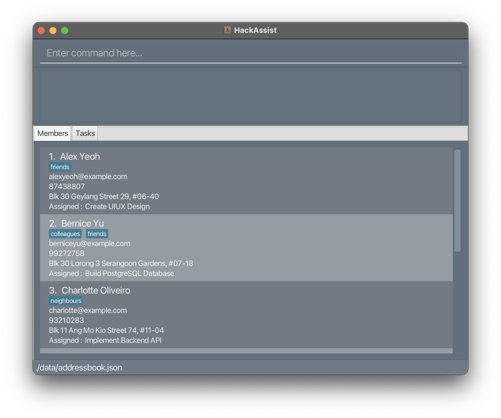

HackAssist is a desktop app for helping hackathon team leaders manage project tasks and team formation more easily.

It is optimized for use via a **Command Line Interface** (CLI) while still having the benefits of a **Graphical User Interface** (GUI). If you can type fast, HackAssist can get your task management done faster than traditional GUI apps.

* Table of Contents
{:toc}

--------------------------------------------------------------------------------------------------------------------

## Quick start

1. Ensure you have Java `11` or above installed in your Computer.

1. Download the latest `HackAssist.jar` from [here](https://github.com/AY2223S1-CS2103T-F12-2/tp/releases).

1. Copy the file to the folder you want to use as the _home folder_ for your HackAssist.

1. Double-click the file to start the app. The GUI similar to the below should appear in a few seconds. Note how the app contains some sample data. 
   

1. Type the command in the command box and press Enter to execute it. e.g. typing **`help`** and pressing Enter will open the help window. 
   Some example commands you can try:

   * **`view Tasks`** : Lists all tasks in tasklist.

   * **`add task coding assignment`** : Adds a task `coding assignment` to the task list.

   * **`delete task`**`3` : Deletes the 3rd task from the task list.

   * **`help`** : Displays help text.

   * **`exit`** : Exits the app.

1. Refer to the [Features](#features) below for details of each command.

--------------------------------------------------------------------------------------------------------------------

## Features

**:information_source: Notes about the command format:** 

* Words in `UPPER_CASE` are the parameters to be supplied by the user. 
  e.g. in `add n/NAME`, `NAME` is a parameter which can be used as `add n/John Doe`.

* Items in square brackets are optional. 
  e.g `n/NAME [t/TAG]` can be used as `n/John Doe t/friend` or as `n/John Doe`.

* Items with `…`​ after them can be used multiple times including zero times. 
  e.g. `[t/TAG]…​` can be used as ` ` (i.e. 0 times), `t/friend`, `t/friend t/family` etc.

* Parameters can be in any order. 
  e.g. if the command specifies `n/NAME p/PHONE_NUMBER`, `p/PHONE_NUMBER n/NAME` is also acceptable.

* If a parameter is expected only once in the command but you specified it multiple times, only the last occurrence of the parameter will be taken. 
  e.g. if you specify `p/12341234 p/56785678`, only `p/56785678` will be taken.

* Extraneous parameters for commands that do not take in parameters (such as `help`, `list`, `exit` and `clear`) will be ignored. 
  e.g. if the command specifies `help 123`, it will be interpreted as `help`.

### Viewing help : `help`

Shows a message explaning how to access the help page.

Format: `help`

### Clearing all entries : `clear`

Clears all entries from the task list.

Format: `clear`

### Exiting the program : `exit`

Exits the program.

Format: `exit`

### Saving the data

HackAssist data are saved in the hard disk automatically after any command that changes the data. There is no need to save manually.

### Editing the data file

HackASsist data are saved as a JSON file `[JAR file location]/data/HackAssist.json`. Advanced users are welcome to update data directly by editing that data file.

:exclamation: **Caution:**
If your changes to the data file makes its format invalid, AddressBook will discard all data and start with an empty data file at the next run.

### Archiving data files `[coming in v2.0]`

_Details coming soon ..._

### Adding a task: `Add Task`

Adds a task to the tasklist.

Format: `add task TASK_DESCRIPTION`

Examples:
* `add task laundry` add laundry to the task list
* `add task coding assignment` add coding assignment to the task list

### Deleting a task: `Delete Task`

Deletes a task from the tasklist.

Format: `delete task TASK_NUMBER` 
* Deletes the task at the specified `TASK_NUMBER`.
* The tasknumber refers to the task number shown in the displayed task list.
* The tasknumber **must be a positive integer** 1, 2, 3, …​

Examples:
* `delete task 1` deletes the first task from the tasklist

### viewing all tasks: `View Tasks`

Lists out all the tasks in the tasklist.

Format: `view tasks` 

### Assigning a task: `Assign`

Assign a task to an existing person.

Format: `assign TASK_NUMBER to PERSON_NAME`
* `TASK_NUMBER` must be smaller than the total number of tasks in task list.
* `PERSON_NAME` must be existing contact in contactbook.

Examples:
* `assign 1 to John` assign tasknumber 1 to John

--------------------------------------------------------------------------------------------------------------------

## FAQ

**Q**: How do I transfer my data to another Computer? 
**A**: Install the app in the other computer and overwrite the empty data file it creates with the file that contains the data of your previous AddressBook home folder.

--------------------------------------------------------------------------------------------------------------------

## Command summary

Action | Format, Examples
--------|------------------
**Clear** | `clear`
**Help** | `help`
**Add Task** | `add task TASK_DESCRIPTION`   e.g., `add task laundry`
**Delete Task** | `delete task TASK_NUMBER`   e.g., `delete task 1`
**View Tasks** | `view tasks`
**Assign** | `assign TASK_NUMBER to PERSON_NAME`   e.g., `assign 1 to John`
